  

 

  
  &nbsp;&nbsp;
  
  &nbsp;&nbsp;
  

 

  

<table width="100%" border="0" cellpadding="0" cellspacing="0">
  <tr>
    <td width="60%" valign="top">
      <h2 align="left" style="border-bottom: none;">ENGINEERING CRAFTSMANSHIP</h2>
      

        I am a Software Engineer focused on building scalable web applications, clean architecture, and uncompromising UI performance. I believe in treating code as craft—where system design and user experience intersect to create products that are both technically robust and visually exceptional. 
      

       
      <h3 align="left">DEVELOPMENT PHILOSOPHY</h3>
      

        <strong>Minimalism in Architecture.</strong> Complexity should be a last resort. Every abstraction must justify its existence.  
        <strong>Obsessive Performance.</strong> Milliseconds matter. From database query optimization to layout shifts on the frontend. 
        <strong>Continuous Evolution.</strong> Technology changes rapidly; a strong grasp of fundamentals ensures adaptability.
      

    </td>
    <td width="5%"></td>
    <td width="35%" valign="top">
      <h3 align="left">CURRENT FOCUS</h3>
      

        ▹ Architecting high-scale SaaS 
        ▹ Next.js App Router Internals 
        ▹ Rust for WebAssembly 
        ▹ Advanced System Design
      

       
      <h3 align="left">LEARNING ROADMAP</h3>
      

        ▹ WebGL & Three.js 
        ▹ Go Microservices 
        ▹ Machine Learning Ops
      

    </td>
  </tr>
</table>

 

  

<h2 align="center">CORE TECHNOLOGIES</h2>

Tools refined through production experience.

 

  <!-- Frontend -->
  
  
  
  
  

  <!-- Backend & Database -->
  
  
  
  
  

  <!-- Tools & Cloud -->
  
  
  
  

  

  

<h2 align="center">SELECTED WORKS</h2>

A showcase of recent engineering efforts.

 

<table width="100%" border="1" bordercolor="#111111" cellpadding="20" cellspacing="0">
  <tr>
    <td width="50%" valign="top" bgcolor="#030303">
      <h3 style="margin-top: 0; color: #EAEAEA;">Smart Society Management</h3>
      
Comprehensive platform for residential administration. Features real-time notifications, automated billing, and secure access control.

      
Next.js • PostgreSQL • WebSockets • Prisma

      
      
    </td>
    <td width="50%" valign="top" bgcolor="#030303">
      <h3 style="margin-top: 0; color: #EAEAEA;">E-Commerce Platform</h3>
      
High-conversion storefront architecture. Integrated with Stripe for payments and optimized for sub-second page loads globally.

      
React • Node.js • Stripe API • Redis Cache

      
      
    </td>
  </tr>
  <tr>
    <td width="50%" valign="top" bgcolor="#030303">
      <h3 style="margin-top: 0; color: #EAEAEA;">Admin Dashboard</h3>
      
B2B analytics interface processing large datasets. Custom D3 visualizations and aggressive performance tuning for data density.

      
TypeScript • D3.js • TailwindCSS • GraphQL

      
      
    </td>
    <td width="50%" valign="top" bgcolor="#030303">
      <h3 style="margin-top: 0; color: #EAEAEA;">Personal Portfolio</h3>
      
A study in digital minimalism and smooth typography. Built to showcase projects with zero distraction and perfect lighthouse scores.

      
Next.js • Framer Motion • MDX

      
      
    </td>
  </tr>
</table>

 

  

<h2 align="center">METRICS</h2>

Open source telemetry and activity data.

 

  
  &nbsp;
  

 

  
  &nbsp;
  

  

  

