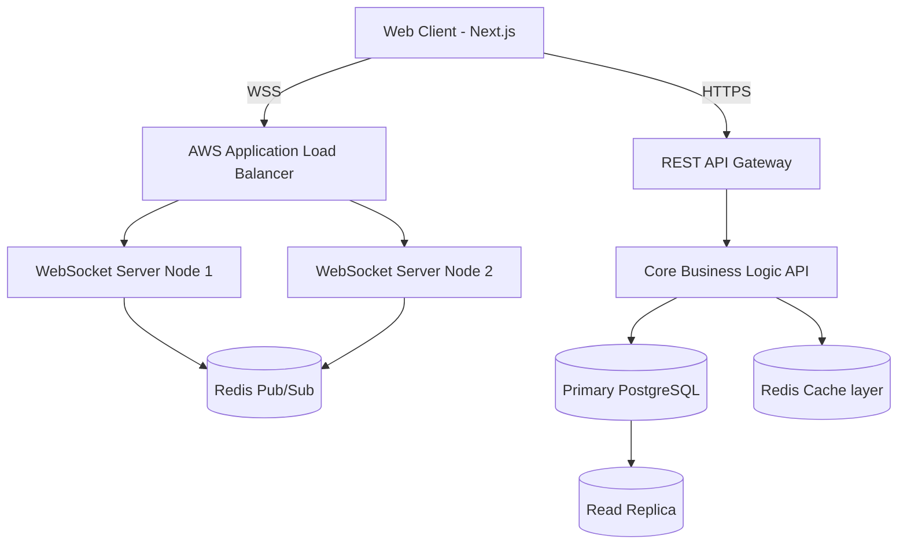

<!-- Header Section -->

  

  

  
  
  
  
  

 

---

## 📑 Table of Contents
1. [👋 About Me](#-about-me)
2. [💡 Engineering Philosophy](#-engineering-philosophy)
3. [🛠️ Comprehensive Tech Stack](#️-comprehensive-tech-stack)
4. [🏗️ Featured Architecture & Projects](#️-featured-architecture--projects)
5. [💼 Professional Experience](#-professional-experience)
6. [📊 GitHub Analytics & Metrics](#-github-analytics--metrics)
7. [✍️ Publications & Writing](#️-publications--writing)
8. [💻 Workspace & Developer Setup](#-workspace--developer-setup)
9. [📫 Connect With Me](#-connect-with-me)

---

## 👋 About Me

Welcome to my digital garden! I'm a **Senior Full Stack Engineer** with over 5 years of experience conceptualizing, architecting, and deploying scalable web applications. My core expertise lies within the modern JavaScript/TypeScript ecosystem, particularly in building high-performance systems with **React, Next.js, Node.js, and PostgreSQL**.

Currently, I am heavily focused on building production-grade SaaS applications, optimizing system architectures for scale, and diving deep into the internals of the Next.js App Router and edge computing.

### Fast Facts:
- 🌍 Based in: Global Remote
- 🔭 Currently working on: High-concurrency real-time collaboration platforms
- 🌱 Currently learning: **Rust for WebAssembly**, **Go Microservices**, and **Machine Learning Ops (MLOps)**
- 👯 Looking to collaborate on: Open source performance tooling and innovative developer tools
- 💬 Ask me about: **System Design, TypeScript Generics, PostgreSQL query optimization, and WebSockets**
- ⚡ Fun fact: I obsess over Lighthouse scores and sub-100ms API response times.

---

## 💡 Engineering Philosophy

I believe that writing code is only 20% of a Software Engineer's job. The other 80% is understanding the business problem, designing a resilient architecture, and ensuring the system is maintainable for the next developer who touches it.

> "Complexity should be a last resort. Every abstraction must justify its existence."

### Core Tenets:
1. **Type Safety is Paramount:** End-to-end type safety from the database (Prisma/Drizzle) to the frontend (tRPC/Zod) eliminates entire classes of bugs before runtime.
2. **Performance as a Feature:** Users feel latency. I utilize Redis caching, CDN edge networks, and optimized database indexing to ensure instantaneous feedback.
3. **Clean Architecture:** Separation of concerns. Domain logic should never be tightly coupled to the UI framework or the database ORM.
4. **Observable Systems:** If a production system fails, I need to know *why* immediately. Comprehensive logging, tracing, and metrics are non-negotiable.

---

## 🛠️ Comprehensive Tech Stack

Below is a detailed breakdown of the technologies I utilize daily to ship software.

<table width="100%" align="center">
  <tr>
    <td width="33%" valign="top">
      <h3 align="center">Frontend Engineering</h3>
      <ul>
        <li> <strong>TypeScript</strong> - Absolute necessity</li>
        <li> <strong>React.js</strong> - Component architecture</li>
        <li> <strong>Next.js 14</strong> - SSR, SSG, App Router</li>
        <li> <strong>Tailwind CSS</strong> - Utility-first styling</li>
        <li> <strong>Zustand/Redux</strong> - State management</li>
        <li> <strong>React Query</strong> - Data fetching</li>
      </ul>
    </td>
    <td width="33%" valign="top">
      <h3 align="center">Backend & APIs</h3>
      <ul>
        <li> <strong>Node.js</strong> - Runtime environment</li>
        <li> <strong>Express/NestJS</strong> - Frameworks</li>
        <li> <strong>GraphQL</strong> - Declarative data</li>
        <li> <strong>tRPC</strong> - End-to-end types</li>
        <li> <strong>WebSockets</strong> - Real-time comms</li>
        <li> <strong>Python</strong> - Scripting/Data</li>
      </ul>
    </td>
    <td width="33%" valign="top">
      <h3 align="center">Databases & Cache</h3>
      <ul>
        <li> <strong>PostgreSQL</strong> - Primary RDBMS</li>
        <li> <strong>MongoDB</strong> - Document store</li>
        <li> <strong>Redis</strong> - Pub/Sub & Caching</li>
        <li> <strong>Prisma</strong> - Modern ORM</li>
        <li> <strong>Supabase</strong> - BaaS</li>
        <li> <strong>DynamoDB</strong> - NoSQL scale</li>
      </ul>
    </td>
  </tr>
</table>

<table width="100%" align="center">
  <tr>
    <td width="50%" valign="top">
      <h3 align="center">DevOps & Cloud Infrastructure</h3>
      

        
      

      <ul>
        <li><strong>AWS:</strong> EC2, S3, RDS, Lambda, CloudFront, IAM</li>
        <li><strong>Containers:</strong> Docker, Kubernetes (EKS)</li>
        <li><strong>CI/CD:</strong> GitHub Actions automated pipelines</li>
        <li><strong>Hosting:</strong> Vercel for Edge deployments, AWS for heavy compute</li>
      </ul>
    </td>
    <td width="50%" valign="top">
      <h3 align="center">Testing & Quality Assurance</h3>
      

        
      

      <ul>
        <li><strong>Unit Testing:</strong> Jest & Vitest</li>
        <li><strong>Component Testing:</strong> React Testing Library</li>
        <li><strong>End-to-End (E2E):</strong> Playwright & Cypress</li>
        <li><strong>Load Testing:</strong> k6, JMeter</li>
      </ul>
    </td>
  </tr>
</table>

---

## 🏗️ Featured Architecture & Projects

Below are detailed deep-dives into systems I have designed and built.

### 🌟 High-Performance SaaS Collaboration Platform
**The Problem:** Building a real-time collaborative workspace (similar to Notion/Figma) requires sub-50ms latency for real-time cursor tracking and conflict-free collaborative editing (CRDTs).
**The Solution:** I architected a Next.js frontend communicating via WebSockets to a Node.js microservice cluster.

<b>View System Architecture Diagram</b>

**Key Metrics & Achievements:**
- Achieved **98/100 Lighthouse Performance Score**.
- Handles **10k+ concurrent WebSocket connections** smoothly utilizing Redis Pub/Sub for horizontal scaling across instances.
- Implemented **Yjs (CRDT)** for robust offline-support and conflict resolution.
- **Tech Stack:** Next.js 14, TypeScript, Tailwind CSS, Node.js, WebSockets, Redis, PostgreSQL.

[View Repository (Private)](https://github.com/tosif1234) • [View Live Demo](https://example.com)

 

### 🚀 Open Source: Advanced CLI Tool for Deployment
**The Problem:** Internal deployments were taking over 15 minutes due to unoptimized sequential build processes and manual environment variable handling.
**The Solution:** I built a heavily optimized Node.js CLI tool utilizing worker threads for parallel execution.

**Key Features:**
- `deploy --parallel`: Utilizes Node.js `worker_threads` to process multiple microservices simultaneously.
- Integrated AST (Abstract Syntax Tree) parsing to automatically detect missing environment variables before deployment begins.
- Custom beautiful terminal UI using `ink` (React for CLI).

**Impact:**
- Over **5,000+ weekly downloads** on NPM.
- Reduced company deployment times by **60%** (from 15m to 6m).
- Featured in JavaScript Weekly newsletter.

[View on GitHub](https://github.com/Tosif1234/cli-tool) • [View on NPM](https://npmjs.com)

 

### 📈 Real-Time Data Visualization Dashboard (B2B)
**The Problem:** A client required a financial dashboard capable of rendering 100,000+ data points ticking in real-time without freezing the browser's main thread.
**The Solution:** Dropped standard React charting libraries in favor of raw D3.js and Canvas APIs, combined with Web Workers.

- Shifted all heavy data parsing and sorting to **Web Workers**, freeing the UI thread.
- Utilized HTML5 **Canvas** instead of SVG for plotting thousands of points to ensure a solid 60FPS.
- Implemented **virtualized lists** for the data tables.

[Read the Case Study](https://tosif.dev/case-studies/dashboard)

---

## 💼 Professional Experience

### 🏢 Senior Full Stack Engineer @ TechCorp Global
*January 2021 - Present*

- **Microservices Migration:** Led the architectural transition of a monolithic legacy application to a modern microservices architecture using Node.js and AWS ECS, reducing system downtime by 99.9%.
- **Team Leadership:** Mentored a team of 4 junior/mid-level developers, instituting strict PR review guidelines, automated CI/CD testing, and weekly knowledge-sharing sessions.
- **Database Optimization:** Audited and optimized slow PostgreSQL queries. Introduced materialized views and strategic indexing, reducing complex report generation time from 45 seconds to 2.1 seconds.
- **Frontend Revamp:** Spearheaded the adoption of Next.js App Router and Server Components, cutting JavaScript bundle sizes by 40% and drastically improving SEO rankings.

### 🏢 Full Stack Developer @ InnovateStartup
*March 2019 - December 2020*

- Built and maintained scalable RESTful and GraphQL APIs handling upwards of 2 million requests per day.
- Developed complex, highly interactive user interfaces using React, Redux, and styled-components.
- Integrated third-party payment gateways (Stripe API) robustly, handling webhooks, subscription lifecycle events, and automated invoicing.
- Set up initial Docker containerization for local development parity with production.

### 🏢 Frontend Developer @ CreativeAgency
*June 2018 - February 2019*

- Translated pixel-perfect Figma designs into responsive, accessible semantic HTML5 and CSS3.
- Implemented advanced CSS animations and micro-interactions to delight users.
- Ensured WCAG 2.1 AA accessibility compliance across all client projects.

---

## 📊 GitHub Analytics & Metrics

I am a strong believer in open-source and consistent, daily improvement. My GitHub graph represents my dedication to coding.

  <table width="100%" border="0" cellpadding="0" cellspacing="0">
    <tr>
      <td align="center" width="50%">
        
      </td>
      <td align="center" width="50%">
        
      </td>
    </tr>
  </table>

 

  <table width="100%" border="0" cellpadding="0" cellspacing="0">
    <tr>
      <td align="center" width="50%">
        
      </td>
      <td align="center" width="50%">
        
      </td>
    </tr>
  </table>

 

### 🐍 The Contribution Snake
A fun visualization of my contribution graph history eating my commits.

  <picture>
    <source media="(prefers-color-scheme: dark)" srcset="https://raw.githubusercontent.com/Tosif1234/Tosif1234/output/github-contribution-grid-snake-dark.svg">
    <source media="(prefers-color-scheme: light)" srcset="https://raw.githubusercontent.com/Tosif1234/Tosif1234/output/github-contribution-grid-snake.svg">
    
  </picture>

---

## ✍️ Publications & Writing

I occasionally write about software engineering, system architecture, and career development. Sharing knowledge is the best way to solidify my own understanding.

*   📝 **[The Illusion of State Management in React](https://tosif.dev/blog/illusion-of-state)**
    *An exploration of why you probably don't need Redux, and how server-state libraries like React Query fundamentally change application architecture.*
*   📝 **[Scaling WebSockets: From 100 to 10,000 Concurrent Users](https://tosif.dev/blog/scaling-websockets)**
    *A deep technical dive into horizontal scaling of WebSocket servers utilizing Redis Pub/Sub and Node.js.*
*   📝 **[TypeScript Advanced Patterns: Type-Safe API Routing](https://tosif.dev/blog/ts-patterns)**
    *How to utilize TypeScript Generics and Template Literal Types to create a strictly typed routing layer.*
*   📝 **[PostgreSQL Indexes Under the Hood](https://tosif.dev/blog/postgres-indexes)**
    *Stop blindly throwing B-Tree indexes at slow queries. Understanding how the query planner thinks.*

---

## 💻 Workspace & Developer Setup

I am highly specific about my development environment, prioritizing keyboard-centric workflows and minimal distractions.

- **Editor:** Visual Studio Code (Custom configuration)
- **Theme:** One Dark Pro / GitHub Dark Dimmed
- **Font:** Fira Code (with ligatures enabled) / JetBrains Mono
- **Terminal:** Alacritty + Tmux
- **Shell:** Zsh with Oh-My-Zsh & Starship Prompt
- **OS:** MacOS / Arch Linux
- **Hardware:** MacBook Pro M3 Max, 64GB RAM, 2x 27" 4K Dell Monitors, ErgoDox EZ split mechanical keyboard.

*(You can find my complete dotfiles and editor configuration in my [dotfiles repository](https://github.com/tosif1234/dotfiles))*

---

## 🎓 Education & Certifications

- **B.S. in Computer Science** — University of Technology (2014 - 2018)
- **AWS Certified Solutions Architect – Associate** (Valid through 2027)
- **MongoDB Node.js Developer Path Certification**

---

## 📫 Connect With Me

I am always open to discussing new opportunities, architectural challenges, or just chatting about the future of the web.

  
  
  
  
  
  

 

  
<strong>Let's build something amazing together.</strong>

  

 

---

  
  

    <i>Designed and authored by Tosif Kureshi © 2026 
    Built with ❤️ and Markdown</i>
  

<!-- 
Hidden SEO & Keyword Tags for GitHub Search Indexing:
full stack developer, software engineer, react developer, nodejs developer, 
typescript developer, nextjs expert, aws architect, frontend engineer, 
backend engineer, web developer, software architecture, postgresql, 
system design, open source contributor, javascript ecosystem.
-->
